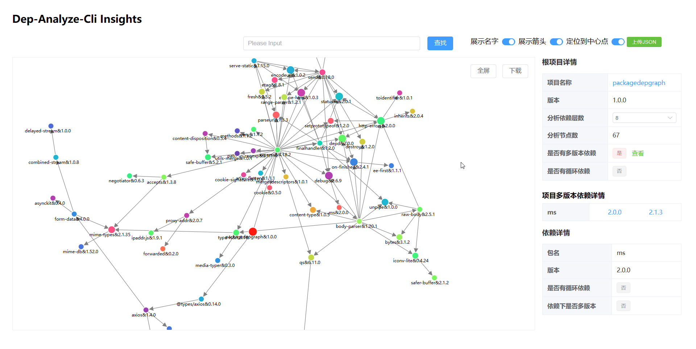

# pkg-insights-d3

此项目作为[dep-analyze-cli](https://github.com/15871687941/dep-analyze-cli-sourcecode)的前端展示页面， 使用 `D3.js`数据可视化工具展示依赖关系



## 项目特色

* 支持查看多版本依赖，点击版本号即可在图像中定位该版本的依赖
* 支持查看构成循环依赖的包名并高亮循环依赖环
* 良好的交互体验：
  * 支持将查找的节点定位到图像中间
  * 点击和查找时缩放节点图像并高亮从其出发的依赖边
  * 拖拽节点以调整图像节点和连线位置
  * 支持平移和缩放整个图像
* 支持图像全屏和图像下载
* 支持在页面修改项目分析层数
* 支持自定义是否展示节点名称，指向箭头
* 支持上传并渲染使用[dep-analyze-cli](https://github.com/15871687941/dep-analyze-cli-sourcecode)导出的本地json分析文件
    
## 项目运行方式

```sh
// Project Setup
npm install
// Compile and Hot-Reload for Development
npm run dev
// Type-Check, Compile and Minify for Production
npm run build
```

之后将build之后的文件放到[dep-analyze-cli](https://github.com/15871687941/dep-analyze-cli-sourcecode)的vue文件夹下，完成部署

## 项目难点

1. **节点定位到中心与图像平移缩放**

   将节点定位到中心需计算出点到图像中心的x, y方向上的距离，然后使用将距离设置到整个图像transform属性，而图像的平移缩放需使用到d3的自定义的zoom事件，需要将ZoomEvent中的transform属性直接赋值给图像的transform属性。但实际中开发中发现，在进行缩放平移之后，将查询的节点定位到图像中心，改变了平移缩放的数据，但是再次将图像平移缩放时，ZoomEvent并不依据设置中心时的新的transform数据，而是采用定位到图像中心之前旧的transform数据，这就导致图像突然回到之前的缩放状态和位置，产生严重的跳跃突变的感觉

   **解决方法：**

    在反复查看d3-zoom的文档，甚至源代码之后，发现通过鼠标平移缩放改变的是ZoomEvent的transform属性，单独设置图像的transform属性不会改变ZoomEvent的transform属性，再次查看文档和源代码，鼠标事件平移缩放保存在图像的 `__zoom`属性上，而ZoomEvent事件中的transform正是通过 `__zoom`属性计算的，所以在将节点定位到中心时，手动更新 `__zoom`就能解决问题。

2. **提升图像的交互体验**

   为了使操作过程中图像有更好的交互效果，需要对依赖图中的节点图像进行改变填充颜色和图像半径大小，对边进行颜色高亮的操作，因此需要频繁查找和操作svg图像中的节点，为了提升效率，需要结合d3的 `select()`方法，给每一个节点都添加id属性，以唯一标识每个节点，因为需要更方便地通过节点名称和版本号查询节点，使用了这两个属性来设置id。 例如 `@types/axios&1.2.3`，需使用正则表达式，去除特殊字符，最终使用 `typesaxios123`作为id。
